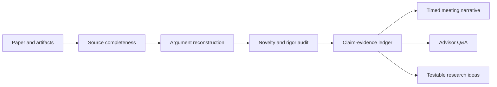

# Paper Review Copilot

**Stop summarizing papers. Start defending a research judgment.**

[](https://github.com/openai/codex)
[](https://github.com/John-art-king/paper-review-copilot/releases)
[](LICENSE)
[](https://github.com/John-art-king/paper-review-copilot/stargazers)

[English](README.md) | [简体中文](README.zh-CN.md)

Paper Review Copilot is an evidence-grounded Codex skill for research group meetings. Give it a paper, PDF, DOI/arXiv link, supplement, or repository. It returns a meeting-ready argument: what problem matters, what is actually new, which evidence supports the mechanism, where the claims overreach, how to present the work, and what your lab should test next.

It is designed for top-conference and journal discussions where "summarize the paper" is not enough.

## One Paper In, A Complete Meeting Pack Out

| Deliverable | What you get |
|---|---|
| Executive verdict | Research question, core insight, mechanism, strongest evidence, largest uncertainty, bottom line |
| Claim-evidence ledger | Every important conclusion linked to a section, page, figure, table, equation, appendix, or artifact |
| Novelty audit | Closest mechanism-level predecessor, exact delta, alternative explanation, missing decisive test |
| Rigor review | Baseline fairness, budget parity, ablations, uncertainty, failure modes, generality, reproducibility |
| Timed slide script | Claim-style slide titles, primary visual, speaker takeaway, transition, and cumulative time |
| Advisor Q&A | Skeptical questions, 20-40 second answers, confidence labels, and evidence that would change the answer |
| Research idea cards | Evidence-backed gaps turned into falsifiable hypotheses and decisive experiments |

## Why This Is Not Another Paper Summarizer

| Typical summary | Paper Review Copilot |
|---|---|
| Rephrases the abstract | Reconstructs the paper's causal argument |
| Repeats contribution claims | Tests novelty against the closest mechanism-level work |
| Lists benchmark numbers | Checks whether protocols, compute, data, and tuning are comparable |
| Hides missing evidence | Marks claims as author claim, evidence, inference, proposal, or unverified |
| Produces topic-style slides | Produces timed claim-style slides with transitions and speaker takeaways |
| Suggests generic future work | Requires a falsifiable hypothesis and a result that would reject it |

## How It Works



The core rule is simple: author claims, direct evidence, reviewer inference, and unresolved uncertainty must never be blended together.

## Quick Start

### 1. Install

macOS / Linux:

```bash
git clone https://github.com/John-art-king/paper-review-copilot.git ~/.codex/skills/group-meeting-paper-review
```

Windows PowerShell:

```powershell
git clone https://github.com/John-art-king/paper-review-copilot.git "$env:USERPROFILE\.codex\skills\group-meeting-paper-review"
```

### 2. Attach A Paper

Provide a PDF or an official paper link. Add the supplement, code repository, and closest prior work when you need a strong novelty or reproducibility verdict.

### 3. Invoke The Skill

```text
Use $group-meeting-paper-review to turn this paper into a 15-minute Chinese
group-meeting pack for a specialist audience. Focus on novelty, experimental
fairness, speaker notes, advisor questions, and two testable follow-up ideas.
```

The skill infers omitted settings, states the chosen review profile, and proceeds without forcing a questionnaire.

## Five Review Modes

| Mode | Best for | Core output |
|---|---|---|
| Triage | Deciding whether to read | Question, mechanism, evidence quality, read/skip verdict |
| Deep review | Understanding one paper | Argument map, evidence ledger, novelty and rigor audit |
| Comparison | Positioning multiple papers | Shared taxonomy, normalized comparison, unresolved disagreement |
| Meeting pack | Presenting to the lab | Full review plus timed slide script, Q&A, and research ideas |
| Rehearsal | Preparing for hard questions | Advisor-style challenge ladder and defended short answers |

## Configure The Presentation

You can set the review in natural language:

- **Language:** Chinese, English, or bilingual
- **Audience:** mixed lab, field specialists, or newcomers
- **Duration:** 5, 10, 15, 20, or 30 minutes
- **Stance:** explanatory, reviewer-critical, or research-opportunity
- **Depth:** triage, deep review, comparison, meeting pack, or rehearsal

For bilingual delivery, slide titles and key terms are bilingual while speaker notes stay in the presenter's primary language.

## Prompt Recipes

**Fast paper triage**

```text
Use $group-meeting-paper-review in triage mode. Tell me whether this paper
deserves a deep read, and cite the evidence behind the verdict.
```

**Top-venue novelty audit**

```text
Use $group-meeting-paper-review to identify the closest mechanism-level prior
work, isolate the exact technical delta, and name the smallest experiment that
could overturn the novelty claim.
```

**Bilingual group meeting**

```text
Use $group-meeting-paper-review to prepare a 20-minute bilingual meeting pack.
Keep technical terms in English, write Chinese speaker notes, and include
claim-style slide titles, transitions, and cumulative timing.
```

**Advisor rehearsal**

```text
Use $group-meeting-paper-review in rehearsal mode. Challenge the central novelty
claim and strongest result, then give evidence-grounded 30-second answers.
```

## Output Preview

The repository includes a compact [synthetic meeting-pack preview](examples/meeting-pack-preview.md). It demonstrates the expected judgment, evidence labels, novelty delta, slide titles, advisor question, and falsifiable idea without pretending that fictional claims are real research findings.

## Evidence Standard

The skill uses three source-completeness levels:

- **Full evidence:** paper plus relevant supplement or official artifacts; supports a deep verdict.
- **Paper only:** supports method and experiment review; reproducibility claims remain qualified.
- **Abstract or metadata only:** supports triage only; no definitive novelty or rigor verdict.

It never invents locators, baselines, datasets, quotes, or results. It does not convert rubric scores into an acceptance probability. When the venue or discipline matters, it calibrates the review for empirical ML, systems, theory, scientific applications, benchmarks, or replication work.

## Repository Map

```text
paper-review-copilot/
|-- SKILL.md                         # Core workflow and routing
|-- agents/openai.yaml               # Codex discovery metadata
|-- assets/                          # Reusable review and slide templates
|-- examples/                        # Representative output preview
`-- references/
    |-- deliverable-contract.md      # Complete meeting-pack contract
    |-- group-meeting-deck.md        # Duration-aware slide narrative
    |-- qa-rehearsal.md              # Advisor-style challenge protocol
    |-- related-work-comparison.md   # Mechanism-level comparison
    |-- research-idea-cards.md       # Falsifiable follow-up design
    |-- top-venue-rubric.md          # Contribution and rigor audit
    `-- venue-calibration.md         # Field-appropriate evidence standards
```

## Scope And Boundaries

This skill supports research reading, critique, discussion, and presentation design. It does not replace domain experts, peer review, or source verification. It does not bundle papers, datasets, model weights, or proprietary artifacts.

Strong novelty conclusions require the closest prior work. Strong reproducibility conclusions require implementation artifacts. When those sources are missing, the skill says so.

## Roadmap

- Public, permission-safe meeting-pack case studies across several disciplines
- Field profiles for computer vision, NLP, systems, robotics, and scientific ML
- A reusable PowerPoint theme and presentation artifact workflow
- Regression evaluations for citation discipline, overclaim detection, and Q&A quality
- Community-contributed venue and lab presentation profiles

## Contributing

Useful contributions include evidence-backed case studies, field-specific evaluation checks, difficult papers that expose workflow failures, and improvements to the presentation templates. Please keep examples permission-safe and label synthetic or incomplete evidence explicitly.

If this skill improves a group meeting, star the repository and share the prompt or paper type that worked. That feedback is more useful than generic feature requests.

## License

MIT. See [LICENSE](LICENSE).
