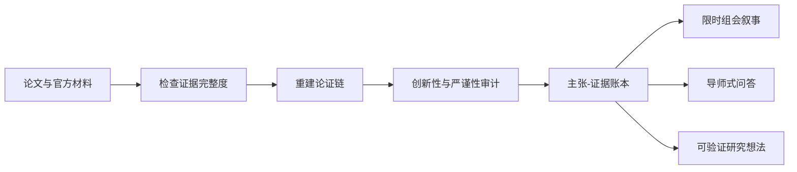

# Paper Review Copilot

**别再复述论文，开始形成经得起追问的研究判断。**

[](https://github.com/openai/codex)
[](https://github.com/John-art-king/paper-review-copilot/releases)
[](LICENSE)
[](https://github.com/John-art-king/paper-review-copilot/stargazers)

[English](README.md) | [简体中文](README.zh-CN.md)

Paper Review Copilot 是一个面向科研组会的 Codex Skill。输入论文 PDF、DOI/arXiv 链接、补充材料或代码仓库，它不会只生成摘要，而会形成一套可以直接用于汇报和讨论的研究论证：问题为什么重要、方法究竟新在哪里、实验支持了什么、证据在哪里停止、应该如何讲清楚，以及课题组下一步值得验证什么。

它专门面向顶会顶刊讨论中最难的部分：创新性判断、证据审计、汇报叙事和导师追问。

## 输入一篇论文，得到一套完整组会包

| 产出 | 内容 |
|---|---|
| 一页结论 | 研究问题、核心洞见、作用机制、最强证据、最大不确定性、最终判断 |
| 主张-证据账本 | 每个关键结论都定位到章节、页码、图、表、公式、附录或官方产物 |
| 创新性审计 | 最近机制级前作、准确技术增量、替代解释、最小决定性实验 |
| 实验可信度审查 | 基线公平性、预算一致性、消融、方差、失败案例、泛化和复现性 |
| 逐页汇报脚本 | 结论式标题、主视觉、讲解要点、转场、单页与累计时间 |
| 导师式问答 | 尖锐问题、20-40 秒短答、可信度标签、什么证据会改变答案 |
| 研究想法卡 | 从已验证缺口出发，形成可证伪假设和决定性实验 |

## 它与普通论文总结有什么不同

| 普通总结 | Paper Review Copilot |
|---|---|
| 改写摘要 | 重建论文的因果论证链 |
| 复述作者贡献 | 与最近机制级工作比较后判断创新性 |
| 罗列指标 | 检查数据、算力、调参和评测协议是否可比 |
| 用流畅文字掩盖缺失证据 | 明确区分作者主张、直接证据、评审推断、研究提案和未验证信息 |
| 生成“背景/方法/实验”式标题 | 生成有结论的逐页标题、转场和讲解要点 |
| 给出泛泛的未来工作 | 每个想法必须包含可被否定的假设和实验 |

## 工作流



最重要的原则只有一个：作者说了什么、证据证明了什么、评审推断了什么、还有什么不知道，不能混在一起。

## 快速开始

### 1. 安装

Windows PowerShell：

```powershell
git clone https://github.com/John-art-king/paper-review-copilot.git "$env:USERPROFILE\.codex\skills\group-meeting-paper-review"
```

macOS / Linux：

```bash
git clone https://github.com/John-art-king/paper-review-copilot.git ~/.codex/skills/group-meeting-paper-review
```

### 2. 添加论文

上传 PDF 或提供官方论文链接。如果需要强创新性结论或复现性判断，最好同时提供补充材料、代码仓库和最近相关工作。

### 3. 调用 Skill

```text
使用 $group-meeting-paper-review，把这篇论文整理成面向本领域研究生的
15 分钟中文组会汇报。重点审查创新性、实验公平性，给出逐页讲稿、
导师可能追问的问题，以及两个可验证的后续研究想法。
```

没有指定的配置会被合理推断，并在输出开头用一行说明，不会先抛出一长串问题阻塞任务。

## 五种模式

| 模式 | 适用场景 | 核心产出 |
|---|---|---|
| 快速筛选 | 判断是否值得精读 | 问题、机制、证据质量、读或跳过结论 |
| 深度评审 | 真正理解单篇论文 | 论证图、证据账本、创新性与严谨性审计 |
| 对比综述 | 定位多篇相关工作 | 统一分类、可比性归一、尚未解决的分歧 |
| 完整组会包 | 正式组会汇报 | 完整评审、逐页讲稿、问答和研究想法 |
| 答辩演练 | 准备导师追问 | 分层挑战问题和有证据的短答案 |

## 自然语言配置

- **语言：** 中文、英文或双语
- **听众：** 混合背景组会、本领域研究者或入门听众
- **时长：** 5、10、15、20 或 30 分钟
- **立场：** 解释型、评审批判型或研究机会型
- **深度：** 快速筛选、深度评审、对比、完整组会包或答辩演练

双语模式下，页面标题和关键术语采用双语，讲稿使用汇报人的主要语言，并保留方法、数据集和指标的标准英文名称。

## 常用提示词

**快速判断是否值得读**

```text
使用 $group-meeting-paper-review 的快速筛选模式，告诉我这篇论文是否值得
精读，并给出支持判断的证据位置。
```

**审查顶会顶刊创新性**

```text
使用 $group-meeting-paper-review 找到最近的机制级相关工作，说明准确技术增量，
并指出哪个最小实验最可能推翻作者的创新性主张。
```

**制作双语组会汇报**

```text
使用 $group-meeting-paper-review 准备 20 分钟双语组会包。技术术语保留英文，
讲稿使用中文，页面标题必须表达结论，并给出转场和累计时间。
```

**模拟导师追问**

```text
使用 $group-meeting-paper-review 的演练模式，重点攻击论文的核心创新性和
最强实验结果，再给出有证据依据的 30 秒回答。
```

## 输出示例

仓库包含一个精简的[组会包预览](examples/meeting-pack-preview.md)。其中论文、方法、数字和定位均为虚构内容，只用于展示结论格式、证据标签、创新性差异、页面标题、导师问题和可证伪想法，不会冒充真实研究结论。

## 证据标准

- **完整证据：** 主论文加相关补充材料或官方产物，可以支持深度判断。
- **只有论文：** 可以评审方法和实验，但复现性结论必须保留条件。
- **只有摘要或元数据：** 只进行快速筛选，不给出确定的创新性和严谨性结论。

Skill 不会虚构页码、引文、基线、数据集或结果，也不会把量表分数包装成录用概率。面对经验机器学习、系统、理论、科学应用、数据集或复现研究时，会使用对应的证据标准。

## 仓库结构

```text
paper-review-copilot/
|-- SKILL.md                         # 核心流程与资源路由
|-- agents/openai.yaml               # Codex Skill 元数据
|-- assets/                          # 评审与逐页讲稿模板
|-- examples/                        # 输出示例
`-- references/
    |-- deliverable-contract.md      # 完整组会包交付标准
    |-- group-meeting-deck.md        # 按时长配置的汇报叙事
    |-- qa-rehearsal.md              # 导师式问答演练
    |-- related-work-comparison.md   # 机制级相关工作比较
    |-- research-idea-cards.md       # 可证伪研究想法设计
    |-- top-venue-rubric.md          # 贡献与严谨性审计
    `-- venue-calibration.md         # 分学科证据标准校准
```

## 适用边界

本 Skill 服务于论文阅读、评审、讨论和组会汇报设计，不能替代领域专家、正式同行评审和原始来源核验。仓库不包含论文、数据集、模型权重或任何私有研究材料。

强创新性结论需要最近相关工作的支持，强复现性结论需要实现产物。材料缺失时，Skill 会明确指出，而不是自行补全。

## 路线图

- 覆盖多个学科且授权清晰的公开组会案例
- 计算机视觉、自然语言处理、系统、机器人和科学机器学习专项配置
- 可复用 PowerPoint 主题与演示文稿生成工作流
- 针对证据定位、过度主张和问答质量的回归评测
- 社区贡献的 venue 与课题组汇报配置

## 参与贡献

欢迎贡献证据完整的案例、分领域评审规则、能够暴露流程缺陷的高难度论文，以及更好的汇报模板。示例必须具有合法使用权限，并明确标注虚构或不完整证据。

如果它确实改善了一次组会，请给仓库一个 Star，并分享有效的提示词或论文类型。这比笼统的功能建议更能帮助项目成长。

## 许可证

MIT，详见 [LICENSE](LICENSE)。
